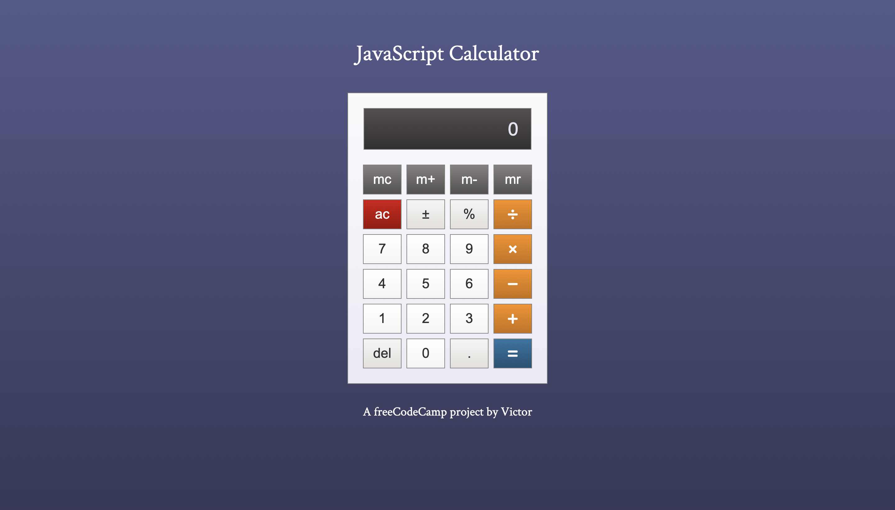

# JavaScript Calculator
https://victordrumond.github.io/javascript-calculator/

## Technologies
`HTML` `CSS` `JavaScript` `jQuery`

## Description
* A responsive calculator built with HTML, CSS and JavaScript (with jQuery).
* A [project](https://www.freecodecamp.org/learn/front-end-development-libraries/front-end-development-libraries-projects/build-a-javascript-calculator) from freeCodeCamp's Front End Development Libraries Certification.
* Extra features: plus/minus, percentage, delete & memory keys.
* Icons from [Font Awesome](https://fontawesome.com).

## Important
Because of the implementation of the plus/minus key as an extra feature, the calculator works slightly differently from what is proposed by freeCodeCamp's project. The minus key is an operation key and should be used to perform subtractions. To enter negative numbers you should always use the plus/minus key.

There are four operation keys representing the four basic operations: `+`, `-`, `x` and `÷`. When two operation keys are pressed consecutively, the last one is considered while the previous is ignored.

For exemple, pressing `5` `x` `-` `2` `=` will return `3` as the result, since pressing `-` right after `x` means that subtraction was selected instead of multiplication. On the other hand, pressing `5` `x` `±` `2` `=` will return `-10`.

## Screenshot
